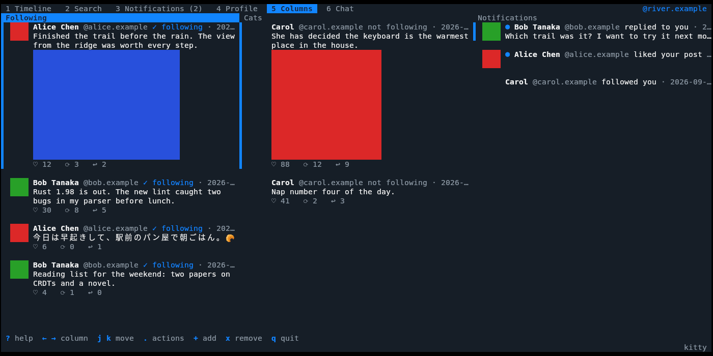

[](https://github.com/nao1215/bluesky-terminal-client/actions/workflows/rust.yml)
[](https://github.com/nao1215/bluesky-terminal-client/actions/workflows/e2e.yml)

[](https://github.com/nao1215/atago)
[](LICENSE)

# bsky

bsky is an unofficial [Bluesky](https://bsky.app) client for the terminal that shows pictures and videos right in the terminal: avatars and photos inline next to their posts, full screen on `Space`, and videos played in place. It draws with the terminal's own image protocol (kitty graphics, sixel, or iTerm2 inline images), and needs nothing else installed.


## Install

With Homebrew (macOS and Linux):

```sh
brew install nao1215/tap/bsky
```

With Cargo (Rust 1.90 or later):

```sh
cargo install --locked bluesky-terminal-client
```

Or download a binary for Linux (x86_64, arm64), macOS (Intel, Apple silicon), or Windows (x86_64) from the [releases page](https://github.com/nao1215/bluesky-terminal-client/releases) and put `bsky` on your `PATH`.

## Try it

Run `bsky` and log in with your handle (or email) and your password. An [app password](https://bsky.app/settings/app-passwords) (Settings, Privacy and security, App passwords) is safer: it cannot change your account settings, and you can revoke it without changing your password. bsky keeps only the session tokens, never the password; `bsky logout` forgets them. Several accounts can be logged in: `A` lists them, switches between them and logs in another.

Pictures and videos need a terminal that can draw images:

| Protocol | Terminals |
|----------|-----------|
| kitty graphics | kitty, Ghostty |
| sixel | foot, mlterm, Windows Terminal 1.22+ |
| iTerm2 inline images | iTerm2, WezTerm |

On a terminal that answers none of them bsky runs as text: each post says how many pictures it has, with their descriptions, or that it has a video, nothing is downloaded to be drawn, and `Space` opens the post on bsky.app in your web browser. Behind a multiplexer that hides the answer, name the protocol with `BSKY_GRAPHICS=kitty`, `sixel`, or `iterm2`.


## What it does

- Timeline of the accounts you follow and your own posts, without reposts. A reply comes with the posts above it; `v` opens the whole thread.
- The feeds you pinned in the Bluesky app (Discover when none are), next to Following on the Timeline tab.
- A Columns tab that shows several lists side by side (the timeline, a pinned feed, notifications, your posts, a search), each acting as its own tab does, kept per account.
- Post, reply, quote, like, repost, follow, and delete your own posts, with links, mentions, and hashtags made clickable.
- Quote posts show the post they quote, with its picture or video; a quote of a feed, a list, or a starter pack is named on one line.
- `c` copies a post's address through the terminal itself (OSC 52), so it works over ssh; in tmux it needs `set-clipboard on`.
- Search posts and accounts, with who you already follow marked.
- Notifications, with an unread count on the tab from the start.
- Direct messages on the Chat tab: the conversations with their unread counts, reading back through a conversation, and writing; `m` on a profile starts one. An app password needs "Allow access to your direct messages" for this.
- Profile editing: display name, description, and avatar.
- Pictures and videos full screen, played, and saved to disk.
- 42 color themes, Bluesky's own colors by default.
- The bottom row keeps to the few keys you need where you are; `.` lists everything that can be done to the selected post, and `?` lists every key.
- A settings screen (`s` on your own Profile tab) for the theme, pictures, and where bsky keeps things.
- A terminal smaller than 24x8 cells says so, and names the size it needs and the size it has, instead of drawing a screen too cramped to read.

| `v`: a post's thread | `/`: search, here for accounts |
|:--:|:--:|
|  |  |
| `.`: what the keys do to a post | `e`: edit your profile |
|  |  |

`5`: the Columns tab, here Following, a pinned feed, and notifications side by side.



| `6`: a conversation on the Chat tab | `A`: the accounts logged in |
|:--:|:--:|
|  |  |

The accounts, posts, and messages in these three pictures are made up and served by [doc/demo-server.py](doc/demo-server.py).

## Pictures and videos

`Space` on a post shows its pictures full screen at their own shape, or plays its video (without sound). `←` `→` go through several pictures, `r` plays the video again, `d` saves it in `Downloads/bsky` (or the folder chosen in the settings), and `Esc` goes back. On a post with only a link, `Space` (or `o` anywhere) opens it in your web browser.


Videos come from Bluesky's HLS stream and are decoded by OpenH264, which is built into bsky, so no player or codec needs to be installed. A video bsky cannot play shows its thumbnail and a warning.

## Posting pictures and videos

`n` writes a post; `Ctrl+O` in it opens a folder browser that previews pictures and describes videos. Attach up to four pictures, or one video or animated GIF, and give each alt text with `Tab`.


bsky turns each photo upright, scales it under Bluesky's size limit, and leaves the camera's metadata (location included) on your disk. Videos go through Bluesky's video service, as the official app does; an account whose email is not confirmed yet is told so before anything is uploaded.

## Themes

`T` opens the picker; the screen follows the selection, `Enter` keeps it.

| `bluesky` (default) | `bluesky-light` | `dracula` |
|:--:|:--:|:--:|
|  |  |  |
| `nord` | `gruvbox` | `catppuccin-latte` |
|  |  |  |

All 42: `bluesky`, `bluesky-dark`, `bluesky-light`, `terminal` (your terminal's palette), `ayu-dark`, `ayu-light`, `catppuccin-frappe`, `catppuccin-latte`, `catppuccin-macchiato`, `catppuccin-mocha`, `cobalt2`, `dracula`, `everforest`, `github-dark`, `github-light`, `gruvbox`, `gruvbox-light`, `horizon`, `iceberg`, `kanagawa`, `material`, `monokai`, `night-owl`, `nightfox`, `nord`, `oceanic-next`, `one-dark`, `one-light`, `palenight`, `papercolor-light`, `rose-pine`, `rose-pine-dawn`, `rose-pine-moon`, `solarized`, `solarized-light`, `synthwave-84`, `tokyo-night`, `tokyo-night-day`, `tokyo-night-storm`, `tomorrow-night`, `zenburn`, `monochrome`. On a 256-color terminal they use the nearest colors; `NO_COLOR` turns color off.

## Command line

Without a command `bsky` opens the client. The commands read and write Bluesky from scripts, as the account in use or the one `-a` names:

```sh
bsky tl -n 5                               # the timeline
bsky post "hello from the terminal"        # a post; --image, --video, --reply, --quote
bsky thread https://bsky.app/profile/alice.test/post/3abc
bsky search rust --json | jq -r .uri       # the server's own objects, one per line
bsky like at://did:plc:.../app.bsky.feed.post/3abc
```

`bsky --help` lists them all: timeline, feed, thread, notifications, search, profile, followers, follows, post, like, unlike, repost, unrepost, follow, unfollow, delete, chat, login, logout, and accounts. A post is named by its at:// URI or its bsky.app address. Writes are sent once and never tried again. With `--json` a write prints what the server answered, and an error is also printed as JSON on stdout. A network or server error exits with status 4.

## Keys

| Key | Action |
|-----|--------|
| `.` | What every key does to the selected post, as a list to choose from |
| `1`–`6`, `Tab` | Timeline, Search, Notifications, Profile, Columns, Chat |
| `j` `k`, `g` `G` | Move; more loads by itself near the end |
| `n` `r` | New post, reply |
| `Q` `c` `D` | Quote the post, copy its address, delete your own post (`y` confirms) |
| `l` `b` `f` | Like, repost, follow (each again undoes it) |
| `[` `]` | Previous or next feed on the Timeline tab |
| `v` | The post's thread |
| `Space` `o` | View pictures or video (as text: open the post in the browser), open the link or the post |
| `Enter` | The author's profile (`Esc` comes back) |
| `/` | Search (`t` switches posts and accounts) |
| `e` `s` | Edit your profile, settings (on your own Profile tab) |
| `m` | Message the account whose profile is shown |
| `i` `Enter` | Chat tab: write a message in the open conversation, send it |
| `←` `→`, `+`, `x`, `<` `>` | Columns tab: the column to act on, add one, remove one, move it |
| `T` | Themes |
| `A` | Accounts: switch, log in another, log out |
| `R` | Refresh |
| `?` `q` | Help, quit |

## Configuration

`s` on your own Profile tab opens the settings: the theme, pictures on or off, the download folder, the picture cache, the video service, and the browser. They are kept in `settings.json` and take effect at once; a variable below that is set wins over it, and the screen says so. `x` puts a setting back to its default.


| Variable | Meaning |
|----------|---------|
| `BSKY_SERVICE` | PDS to log in to (default `https://bsky.social`; also `--service`) |
| `BSKY_ACCOUNT` | Account to use for this run, by handle or DID, without changing the one in use (also `-a`) |
| `BSKY_CONFIG_DIR` | Where `session.json` and `settings.json` live (default `~/.config/bsky` and the platform equivalents) |
| `BSKY_CACHE_DIR` | Where downloaded pictures are kept between runs; `off` keeps none |
| `BSKY_DOWNLOAD_DIR` | Where `d` saves (default `Downloads/bsky`) |
| `BSKY_GRAPHICS` | Force `kitty`, `sixel`, or `iterm2` |
| `BSKY_BROWSER` | Program that opens links (default `xdg-open`, `open`, or the Windows URL handler) |
| `BSKY_VIDEO_SERVICE` | Video service for uploads (default `https://video.bsky.app`) |
| `NO_COLOR` | No color |

Exit status: 0 success, 1 usage error, 2 not an interactive terminal, 3 local file error, 4 a command's network or server error. In the client, server errors do not end bsky; they are shown in it and can be retried.

## Other terminal clients

Two other clients that run in a terminal, each good at different things. The table is from their READMEs and source as of September 2026; their projects are the place to check what they do now.

| | bsky | [tuisky](https://github.com/sugyan/tuisky) | [mattn/bsky](https://github.com/mattn/bsky) |
|---|---|---|---|
| Written in | Rust | Rust | Go |
| Interface | Full-screen client, and commands | Full-screen client | Commands |
| Pictures and videos | Drawn in the terminal, videos played | Listed as links that open in the browser | Not shown |
| Several columns | Yes | Yes | Not applicable |
| Several accounts | Yes | Yes | Yes, as named profiles |
| New posts arrive without a key | Chat only | Yes, on a set interval | `stream` prints posts from the whole network as they are made |
| Notifications | Yes | No | Yes |
| Direct messages | Yes | No | Yes |
| Posting | Text, pictures, video, reply, quote | Text, pictures, quote | Text, pictures, video, reply, quote |
| Block, mute, report, lists | No | No | Yes |
| App passwords, invite codes | No | No | Yes |
| JSON output | Every command | No | Most commands |
| Key bindings | Fixed | Set in a TOML file | Not applicable |
| MCP server | No | No | Yes |
| Install | Homebrew, Cargo, release binaries | Cargo, AUR, x-cmd | `go install`, release binaries |

## Contributing

```sh
just test   # unit tests
just lint   # clippy
just e2e    # end-to-end tests with atago
```

The end-to-end tests in [e2e/atago](e2e/atago) run the real binary with [atago](https://github.com/nao1215/atago) in a pseudo-terminal that answers like a kitty terminal, against mock Bluesky servers: what is drawn (pictures compared pixel for pixel), what is sent, and what is written to disk. The GIFs and screenshots above are recorded with [doc/record-demo.sh](doc/record-demo.sh). See [CONTRIBUTING.md](CONTRIBUTING.md).

## License

[MIT](LICENSE). bsky is not made by, affiliated with, or endorsed by Bluesky Social PBC.
