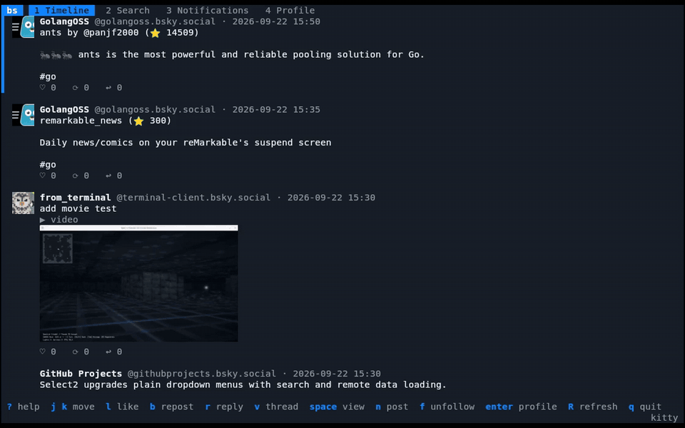

# bs

[](https://github.com/nao1215/bluesky-terminal-client/actions/workflows/rust.yml)
[](https://github.com/nao1215/bluesky-terminal-client/actions/workflows/e2e.yml)
[](https://github.com/nao1215/atago)
[](LICENSE)

bs is a [Bluesky](https://bsky.app) client for the terminal that draws pictures inline, in the terminal's own graphics protocol, next to the posts they belong to.



- The timeline shows posts written by the accounts you follow and by you, and nothing else: no reposts, no one you do not follow. A reply is shown under the posts it answers, and `v` opens its whole thread with every reply expanded.
- Avatars and attached photos are drawn at their own shape with kitty graphics, sixel, or iTerm2 inline images.
- Post, reply, like, and repost; search posts and accounts; follow and unfollow; read your notifications; edit your display name, description, and avatar. Lists load more as you reach the end.
- Attach up to four pictures, or one video or animated GIF, to a post, chosen in a folder browser that previews them, each with alt text.
- `Space` on a post shows its pictures full screen or plays its video, and `d` saves them.
- Bluesky's own colors by default, and 42 themes in all (Dracula, Nord, Gruvbox, Solarized, Catppuccin, Tokyo Night, Rosé Pine, One Dark, GitHub, and more), previewed live and remembered.
- The keys for the current view are always on screen, and `?` lists all of them.
- A terminal that cannot draw images is refused at startup instead of giving you a client that silently drops every picture.

## Requirements

A terminal with an image protocol:

| Protocol | Terminals |
|----------|-----------|
| kitty graphics (unicode placeholders) | kitty, Ghostty |
| sixel | foot, mlterm, Windows Terminal 1.22+, xterm started with `-ti vt340` |
| iTerm2 inline images | iTerm2, WezTerm |

bs asks the terminal which protocols it speaks. When the terminal answers none of them, bs exits with status 2:

```console
$ bs
error: this terminal cannot display images
hint: use a terminal with kitty graphics, sixel, or iTerm2 inline images (kitty, Ghostty, WezTerm, foot, iTerm2, ...), or set BS_GRAPHICS when yours supports one but does not answer the query
```

Some multiplexers pass images through but do not pass the question along. For those, name the protocol yourself with `BS_GRAPHICS=kitty`, `sixel`, or `iterm2`.

## Installation

```sh
cargo install --locked --git https://github.com/nao1215/bluesky-terminal-client
```

The package is `bluesky-terminal-client`; the command it installs is `bs`. Rust 1.90 or later is required.

## Getting started

Create an app password in the Bluesky app (Settings, Privacy and security, App passwords), then run:

```sh
bs
```

The first start asks for your handle (or email) and the app password. bs never stores the password: it keeps the session tokens the server returns, in `session.json` in the config directory, readable only by you on Unix. `bs logout` removes it.

To use a PDS other than bsky.social:

```sh
bs --service https://pds.example.com
```

## Keys

The bottom row always shows the keys that work where you are; `?` opens the full list.

| Key | Action |
|-----|--------|
| `1` `2` `3` `4`, `Tab` `Shift+Tab` | Timeline, Search, Notifications, Profile |
| `j` `k`, `↓` `↑` | Move the selection (`g` / `G` for top and bottom); more loads by itself near the end |
| `n` | New post |
| `Ctrl+O` | In the composer, choose pictures or a video to attach; in the profile editor, choose the avatar |
| `r` | Reply to the selected post |
| `l` | Like, or remove your like |
| `b` | Repost, or remove your repost |
| `f` | Follow or unfollow the selected account (the author of the selected post, or the profile shown) |
| `v` | Open the thread of the selected post: the posts above it and every reply |
| `Space` | View the selected post's pictures full screen, or play its video; a post with neither opens its link |
| `o` | Open the selected post's link (its link card, else the first link in its text) in the web browser |
| `Enter` | Open the profile of the selected account or post author |
| `/` | Search. Arriving at an empty Search tab puts the cursor in the box; `/` or `i` types again later. `Ctrl+T` in the box, or `t` outside it, switches between posts and accounts |
| `e` | Edit your profile (Profile tab) |
| `T` | Choose a color theme |
| `R`, `F5` | Refresh the current view |
| `Esc` | Close a thread or a window, leave the search box, go back from a profile to the search, timeline, or notifications it was opened from |
| `Ctrl+S` | Send the post, save the profile |
| `?` | Help |
| `q`, `Ctrl+C` | Quit |

Links, mentions, and hashtags in posts you write become clickable: bs finds them in the text and sends the rich-text facets Bluesky needs. A mention whose handle does not resolve stays plain text. The composer counts characters the way Bluesky does and refuses to send more than 300.

## Pictures and videos

`Ctrl+O` in the composer opens a browser of the folder you started bs in (or the one it showed last). It lists folders, pictures (PNG, JPEG, GIF, WebP), and videos (MP4, MOV, WebM, MPEG) only. The selected picture is drawn beside the list with its size; a video on your disk is described by its length, shape, and size.

| Key | Action |
|-----|--------|
| `j` `k` | Move; the selected picture is previewed |
| `Enter`, `l` | Open the folder, or choose the picture |
| `Space` | Mark a picture; `Enter` then chooses every marked one (and the one under the cursor), from any folder |
| `h`, `Backspace` | The folder above |
| `.` | Show or hide hidden files |
| `~` | Your home folder |
| `Esc` | Close without choosing |

A post carries up to four pictures or one video, not both. An animated GIF counts as a video: Bluesky shows animation only as video.

Back in the composer, each picture has a thumbnail and a line for its alt text: `Tab` moves between the post and the alt texts, and `Ctrl+X` removes the picture being described (or the last one). A post with pictures needs no text.

Every picture is decoded and encoded again before it is uploaded: a photo taken sideways is turned upright, one larger than 2000 pixels on a side is scaled down, and the result is brought under Bluesky's 1 MB limit, as a PNG when a screenshot fits and as a JPEG otherwise. The camera's metadata, location included, stays on your disk. All pictures are read before any is uploaded, so one that cannot be read stops the post before anything is sent.

A video (at most 100 MB and 3 minutes) or animated GIF is uploaded to Bluesky's video service, the way the official app does it: the PDS issues a short-lived token for the service, and bs waits while the service processes the file before posting. The service converts a GIF itself, so bs needs no codec and no external program.

## Viewing pictures and videos

`Space` on a post opens its pictures full screen, each as large as the screen allows at its own shape, with its alt text under it; a video plays in the same place, without sound. `Esc` goes back to where you were.

| Key | Action |
|-----|--------|
| `←` `→`, `h` `l` | Previous / next picture |
| `r` | Play the video again |
| `d` | Save the picture (full size) or video in `Downloads/bs` (the platform download folder, or `BS_DOWNLOAD_DIR`) |
| `Esc` | Back |

Videos are played from Bluesky's HLS stream, in its lightest variant, and decoded by OpenH264, which is built into bs: nothing else is installed, and no external program is run. A video bs cannot play (not H.264, or not reachable) shows its thumbnail with a warning saying why. A saved video is its best variant's segments joined into one `.ts` file, which players such as mpv and VLC play as it is.

## Themes

`T` opens the theme picker. Moving the selection (`j` `k`, `g` `G`, `PgUp` `PgDn`) redraws the screen in that theme; `Enter` keeps it and `Esc` goes back to the one you had. The choice is saved in `settings.json` in the config directory, which bs writes only when you apply a theme.

| Themes | |
|--------|-|
| Bluesky | `bluesky` (the default, Bluesky's "dim" look), `bluesky-dark`, `bluesky-light` |
| Dark | `ayu-dark`, `catppuccin-frappe`, `catppuccin-macchiato`, `catppuccin-mocha`, `cobalt2`, `dracula`, `everforest`, `github-dark`, `gruvbox`, `horizon`, `iceberg`, `kanagawa`, `material`, `monokai`, `night-owl`, `nightfox`, `nord`, `oceanic-next`, `one-dark`, `palenight`, `rose-pine`, `rose-pine-moon`, `solarized`, `synthwave-84`, `tokyo-night`, `tokyo-night-storm`, `tomorrow-night`, `zenburn` |
| Light | `ayu-light`, `catppuccin-latte`, `github-light`, `gruvbox-light`, `one-light`, `papercolor-light`, `rose-pine-dawn`, `solarized-light`, `tokyo-night-day` |
| Terminal | `terminal` (your terminal's own palette), `monochrome` (no color) |

`terminal` uses your terminal's own sixteen colors. The others are 24-bit palettes; on a terminal that does not set `COLORTERM=truecolor` they are drawn with the nearest of the 256 standard colors. With `NO_COLOR` set, bs draws without color.

## Configuration

| Variable | Meaning |
|----------|---------|
| `BS_SERVICE` | PDS to log in to, like `--service` (default `https://bsky.social`) |
| `BS_CONFIG_DIR` | Directory for `session.json` and `settings.json` (default: `bs` in the platform config directory: `~/.config/bs` on Linux, `~/Library/Application Support/bs` on macOS, `%APPDATA%\bs` on Windows) |
| `BS_GRAPHICS` | Force an image protocol: `kitty`, `sixel`, or `iterm2` |
| `BS_CACHE_DIR` | Directory for downloaded pictures kept between runs (default: `bs` in the platform cache directory); `off` keeps none |
| `BS_VIDEO_SERVICE` | Video service to upload videos to (default `https://video.bsky.app`) |
| `BS_BROWSER` | Program that opens links (default: `xdg-open` on Linux, `open` on macOS, the URL handler on Windows) |
| `BS_DOWNLOAD_DIR` | Folder the viewer's `d` saves in (default: `bs` in the platform download folder) |
| `NO_COLOR` | Draw without color, whatever theme is chosen |

A `settings.json` that cannot be read is reported and ignored; bs starts with the default theme and leaves the file as it is.

## Exit status

| Code | Meaning |
|------|---------|
| 0 | Success |
| 1 | Usage error: unknown flag, malformed `--service`, unknown `BS_GRAPHICS` |
| 2 | The terminal is unsupported: stdin or stdout is not a terminal, or there is no image protocol |
| 3 | A local file could not be read or written, such as a corrupt `session.json` |

Errors are printed as `error:` and, where there is a next step, `hint:`. Network and server errors do not end the client: they are shown in it, and the action can be retried.

## Development

```sh
just test      # unit tests
just lint      # clippy
just e2e       # end-to-end suite (needs atago)
```

The end-to-end suite in [e2e/atago](e2e/atago) runs the real binary with [atago](https://github.com/nao1215/atago). It drives bs in a pseudo-terminal that answers like a kitty-graphics terminal and stubs the Bluesky API with mock servers, so it asserts, offline, what is drawn on the screen (including the images, compared pixel for pixel), what bs sends to the server, and what it writes to disk. See [CONTRIBUTING.md](CONTRIBUTING.md).

## License

[MIT](LICENSE)
